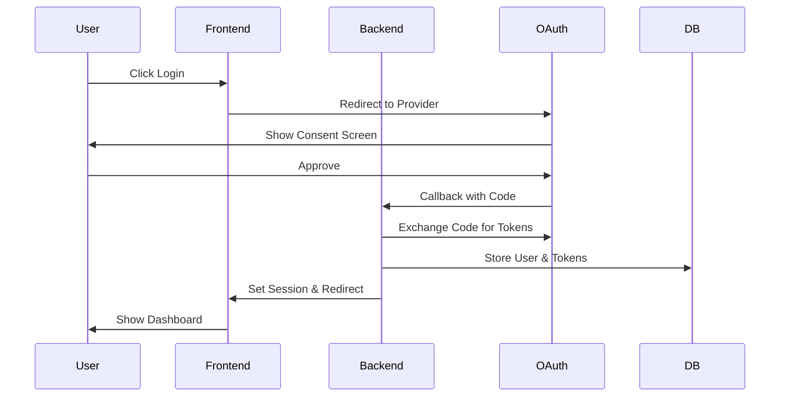

# Social Media Login Service

A secure authentication service supporting Google and Facebook login.

## Features
- OAuth 2.0 integration with Google and Facebook
- Secure session management
- JWT token-based authentication
- Rate limiting and security headers
- Error handling and logging

## Setup Instructions

### Prerequisites
- Node.js 16+
- PostgreSQL
- Google OAuth credentials
- Facebook OAuth credentials

### Environment Variables
```env
# Backend (.env)
DATABASE_URL=your_postgres_url
GOOGLE_CLIENT_ID=your_google_client_id
GOOGLE_CLIENT_SECRET=your_google_secret
FACEBOOK_APP_ID=your_facebook_app_id
FACEBOOK_APP_SECRET=your_facebook_secret
```

### Running Locally
1. Clone the repository
2. Install dependencies:
   ```bash
   cd logins-api && npm install
   cd ../logins-client && npm install
   ```
3. Start the services:
   ```bash
   # Backend
   cd logins-api && npm run dev
   # Frontend
   cd logins-client && npm start
   ```

## Screenshots

### Login Page

Initial login screen with social login options

### Social Login Flows

#### Google Login

Google OAuth consent screen and successful login state

#### Facebook Login

Facebook OAuth consent screen and successful login state

### Dashboard

Protected dashboard showing authenticated user information

### Error Handling

Example of error state during failed authentication

## Architecture
- Frontend: React + TypeScript
- Backend: Node.js + Express + TypeScript
- Database: PostgreSQL
- ORM: Prisma
- Deployment: Vercel

## Testing
```bash
# Run unit tests
npm test

# Run E2E tests
npm run cypress:open
```

### Unit Tests
- Auth flows
- Token handling
- Session management

### E2E Tests
- Login flows
- Error scenarios
- Session persistence

### Security Tests
- Headers
- CSRF protection
- Rate limiting

## Troubleshooting
- **OAuth Errors**: Check your client IDs and callback URLs
- **Database Errors**: Verify your PostgreSQL connection
- **CORS Issues**: Ensure frontend URL is whitelisted

## Authentication Flow


## Security Measures
- HTTPS only
- Secure session management
- Environment variable protection
- CORS configuration
- Input validation
- Error logging

## Database Schema
```prisma
model User {
    id           String    @id @default(cuid())
    email        String    @unique
    name         String?
    picture      String?
    provider     String    // "google" or "facebook"
    providerId   String    // ID from the provider
    createdAt    DateTime  @default(now())
    updatedAt    DateTime  @updatedAt
    accessToken  String?   // OAuth access token
    refreshToken String?   // OAuth refresh token
    profilePhoto String?   // URL to profile photo
    sessions     Session[]

    @@index([provider, providerId])
}

model Session {
    id        String   @id @default(cuid())
    userId    String
    token     String   @unique
    expires   DateTime
    createdAt DateTime @default(now())
    user      User     @relation(fields: [userId], references: [id])
}
```

## Error Handling
Our application implements comprehensive error handling:

### Frontend
- OAuth failures
- Network request errors
- Form validation
- Session expiration

### Backend
- Database errors
- Authentication failures
- Invalid requests
- Session management

### Logging
- Client-side console logging
- Server-side structured logging
- Error tracking and monitoring 

### OAuth Errors
- Invalid credentials
- Expired tokens
- Revoked access

### API Errors
| Status | Description           | Action                    |
|--------|----------------------|---------------------------|
| 401    | Unauthorized         | Redirect to login         |
| 403    | Forbidden           | Check permissions         |
| 500    | Server Error        | Retry with exponential backoff |

### Security Measures
- Rate limiting
- CSRF protection
- Secure session handling
- Input validation

## API Documentation

### Authentication Endpoints

#### GET /auth/google
Initiates Google OAuth flow

#### GET /auth/facebook
Initiates Facebook OAuth flow

#### GET /auth/me
Returns current user information

Response:
```json
{
  "user": {
    "id": "string",
    "email": "string",
    "name": "string",
    "provider": "google|facebook"
  }
}
``` 